# Part 2 — Deploying a Windows 10 Agent & Sysmon

**Series:** [SOC Home Lab](../README.md) | **Part:** 2 of [SOC-Lab-Part1](https://github.com/Muhammad-Umer-NSC/SOC-Lab/blob/main/SOC-Lab-Part1/README.md)
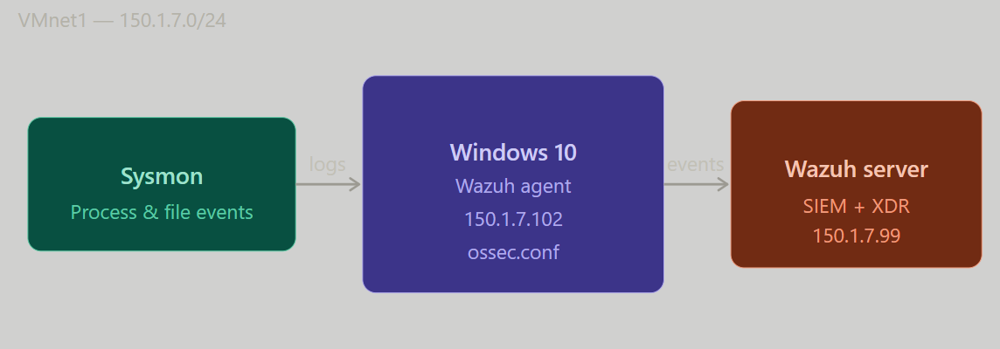

---

## 📖 Table of Contents

1. [What is a Wazuh Agent?](#what-is-a-wazuh-agent)
2. [What are Logs and Why Do They Matter?](#what-are-logs-and-why-do-they-matter)
3. [Lab Network Overview](#lab-network-overview)
4. [Step 1 — Download Windows 10 ISO](#step-1--download-windows-10-iso)
5. [Step 2 — Create the Windows 10 VM in VMware](#step-2--create-the-windows-10-vm-in-vmware)
6. [Step 3 — Install Windows 10](#step-3--install-windows-10)
7. [Step 4 — Assign a Static IP to the Windows 10 VM](#step-4--assign-a-static-ip-to-the-windows-10-vm)
8. [Step 5 — Deploy the Wazuh Agent](#step-5--deploy-the-wazuh-agent)
9. [Step 6 — Install Sysmon](#step-6--install-sysmon)
10. [Step 7 — Configure ossec.conf](#step-7--configure-ossecconf)
11. [Step 8 — Verify Logs on the Wazuh Dashboard](#step-8--verify-logs-on-the-wazuh-dashboard)
12. [What We Covered](#what-we-covered)

---

## What is a Wazuh Agent?

In Part 1 we set up the **Wazuh Server** — the brain of our SOC that collects, processes, and alerts on security events. But the server on its own can only see itself. To monitor other machines in the network, we need **agents**.

A **Wazuh Agent** is a lightweight piece of software installed on an endpoint (in our case, a Windows 10 VM) that continuously collects security data from that machine and ships it back to the Wazuh server in real time.

Once deployed, the agent gives Wazuh visibility into:
- Running processes
- File system changes
- Windows Event Logs
- Network connections
- User activity

Think of the server as the SOC analyst and the agent as the security camera installed on each machine — it watches everything and reports back.

---

## What are Logs and Why Do They Matter?

**Logs** are records of events that happen on a system. Every time a user logs in, a file is created, a process runs, or a network connection is made — the operating system records it.

On their own, logs are just raw data. But in a SOC environment, logs are the **primary source of truth** for detecting threats. They answer questions like:

- Was there an unauthorized login attempt?
- Did a process run that shouldn't be running?
- Was a sensitive file accessed or modified?
- Is malware trying to communicate outbound?

Without logs, you're flying blind. With them, you have a detailed trail of everything that happened on a machine — before, during, and after an incident.

In this part we'll make sure our Windows 10 VM is generating rich, detailed logs and sending them all to Wazuh.

---

## Lab Network Overview

| Machine | Interface | IP Address |
|---------|-----------|-----------|
| Wazuh Server | VMnet1 | `150.1.7.99` |
| Host Machine | VMnet1 | `150.1.7.100` |
| Windows 10 Agent | VMnet1 | `150.1.7.102` |

The Windows 10 VM will have two network adapters — NAT (VMnet8) for internet access during setup, and VMnet1 for communication with the Wazuh server on the isolated internal network.

---

## Step 1 — Download Windows 10 ISO

Download the official Windows 10 ISO directly from Microsoft:
🔗 [https://www.microsoft.com/en-us/software-download/windows10](https://www.microsoft.com/en-us/software-download/windows10)

---

## Step 2 — Create the Windows 10 VM in VMware

1. Open **VMware Workstation**
2. Click **File** → **New Virtual Machine**
3. Select **Typical** → click **Next**
4. Select **Installer disc image file (ISO)** → click **Browse**
5. Navigate to your downloaded Windows 10 ISO, select it → click **Next**
6. Give your VM a name — e.g. **Windows 10 Wazuh Agent**
7. Choose the drive where you want to install it — make sure you have at least **50GB of free space**
8. Click **Next**
9. Select **Store virtual disk as a single file**
10. Assign at least **50GB** of disk space → click **Next**
11. Click **Customize Hardware**
12. Click **Add** → select **Network Adapter** → click **Finish**
13. Set **Network Adapter 1** to **NAT (VMnet8)**
14. Set **Network Adapter 2** to **VMnet1**
15. Click **Finish**

---

## Step 3 — Install Windows 10

Power on the VM and go through the standard Windows 10 installation process.

If you've never installed Windows before, follow this guide:
🎬 [How to Install Windows 10](https://youtu.be/-85D8WIKaCc)

---

## Step 4 — Assign a Static IP to the Windows 10 VM

Once Windows 10 is installed and running, assign a static IP so it can communicate reliably with the Wazuh server over VMnet1.

1. Inside the Windows 10 VM, open **Control Panel** → **Network and Internet** → **Network and Sharing Center**
2. Click **Change adapter settings** (left panel)
3. You'll see two interfaces — double-click **Ethernet1** (this is VMnet1)
4. Click **Properties**
5. Double-click **Internet Protocol Version 4 (TCP/IPv4)**
6. Select **Use the following IP address** and enter:

```
IP Address:   150.1.7.102
Subnet Mask:  255.255.255.0
Gateway:      150.1.7.100
```

7. Click **OK**

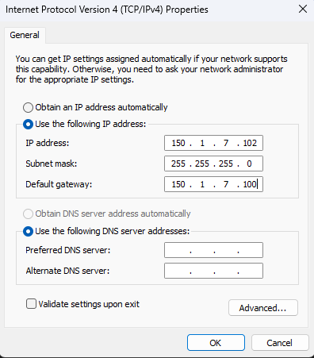

**Verify connectivity** by opening Command Prompt and pinging your host machine:

```cmd
ping 150.1.7.100
```

If you get replies, your Windows 10 VM is correctly on the internal network.

---

## Step 5 — Deploy the Wazuh Agent

**Boot the Wazuh VM** and open the Wazuh dashboard in your browser:

```
https://150.1.7.99
```

Log in with `admin / admin`.

**Navigate to agent deployment:**

- If the dashboard shows agent stats (Active, Disconnected, Never Connected), click **Active** and look for the **Deploy new agent** option
- Otherwise look for **"Deploy agent"** or **"Add agent"** directly on the dashboard

**Configure the agent:**

1. Select **Windows MSI (64/32-bit)**
2. Under **Server Address**, enter your Wazuh server IP:
   ```
   150.1.7.99
   ```
   > ⚠️ Make sure this is the **Wazuh server IP**, not your Windows 10 VM IP

3. Optionally assign an **Agent Name** for easy identification — e.g. `Win10-Agent`

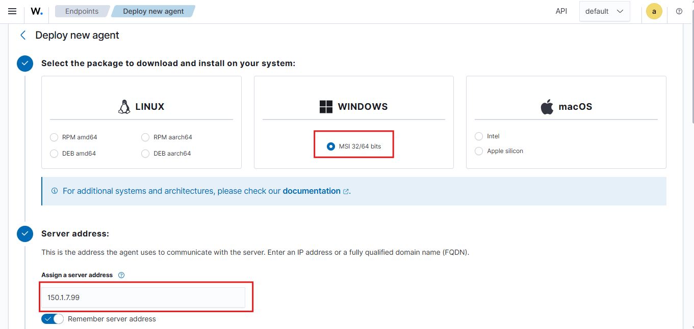
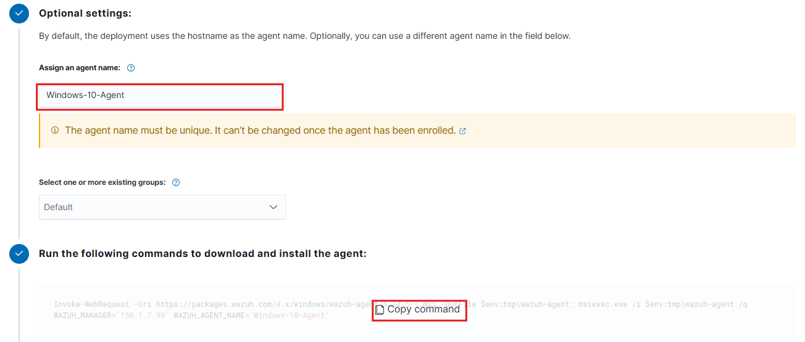
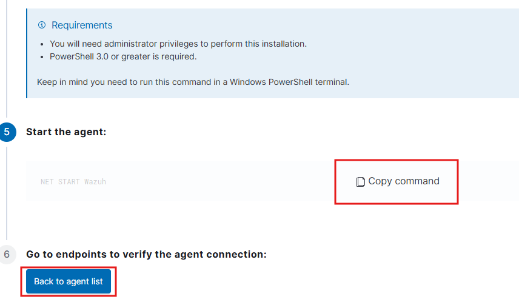

**Run the install command:**

Wazuh will generate an install command for you. Copy it, then:

1. Open **PowerShell as Administrator** on your Windows 10 VM
2. Paste the command and press **Enter** — this installs the Wazuh agent
3. Once done, paste the second command Wazuh gives you and press **Enter** — this starts the agent service
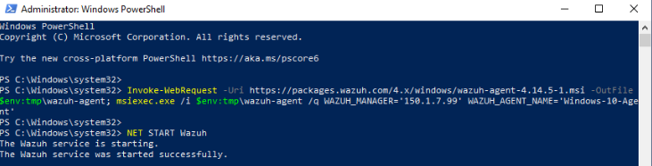

**Confirm the agent is active:**
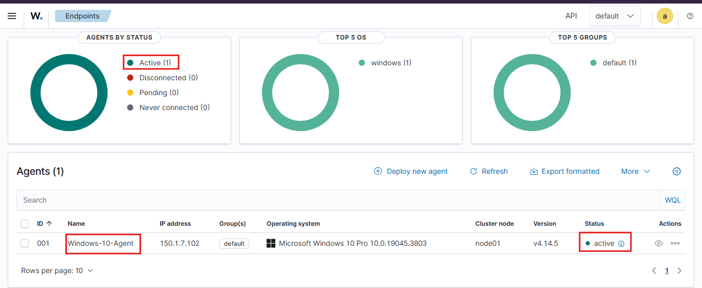

Go back to the Wazuh dashboard and click **Back to agent list**. Your Windows 10 machine should appear as **Active**.

> If it shows **Never Connected** or **Disconnected**, wait a moment and refresh the browser page.

---

## Step 6 — Install Sysmon

The default Windows Event Logs give us a good baseline, but **Sysmon (System Monitor)** takes logging to another level. It's a free Microsoft Sysinternals tool that captures detailed events like:

- Process creation with full command-line arguments
- Network connections initiated by processes
- File creation and modification timestamps
- Registry changes
- Driver and DLL loading

Without Sysmon, a lot of attacker activity simply won't show up in standard Windows logs. With it, we get the kind of visibility that threat hunters rely on.

**Download Sysmon:**
🔗 [https://download.sysinternals.com/files/Sysmon.zip](https://download.sysinternals.com/files/Sysmon.zip)

**Download the Sysmon config file:**

Running Sysmon without a config floods Wazuh with thousands of noisy, low-value events. The SwiftOnSecurity config is a community-maintained filter that keeps only what matters.

🔗 [https://github.com/SwiftOnSecurity/sysmon-config](https://github.com/SwiftOnSecurity/sysmon-config)

Download `sysmonconfig-export.xml` from that repo.

**Install Sysmon with the config:**

1. Extract `Sysmon.zip`
2. Copy `sysmonconfig-export.xml` into the same folder as `Sysmon.exe`
3. Open **PowerShell as Administrator** and navigate to the Sysmon folder:

```powershell
cd C:\Path\To\Sysmon\
```

4. Run the following command to install Sysmon with the config:

```powershell
.\Sysmon.exe -accepteula -i .\sysmonconfig-export.xml
```

**Verify Sysmon is running correctly:**

```powershell
sysmon -c
```

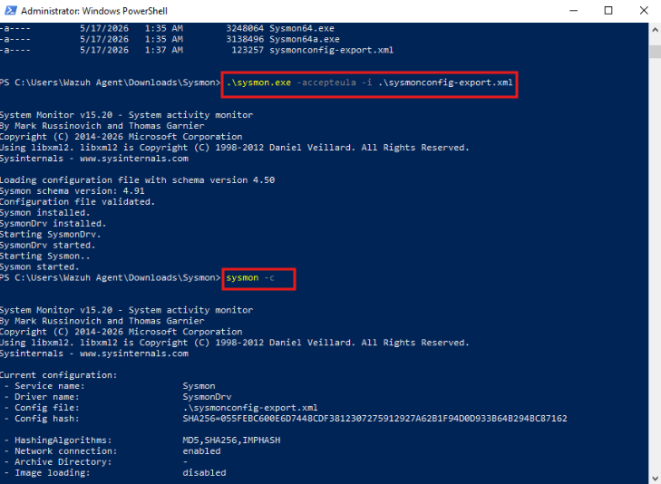

If you see a list of filters, Sysmon is installed and configured correctly.

---

## Step 7 — Configure ossec.conf

Now we need to tell the Wazuh agent two things:
1. Collect Sysmon logs and forward them to the server
2. Monitor specific directories for file changes

Navigate to the Wazuh agent folder on your Windows 10 VM:

```
C:\Program Files (x86)\ossec-agent\
```

Right-click **win32ui.exe** and run it as Administrator. In the window that opens:

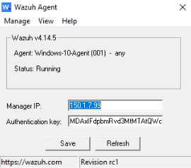

- Click **View** → **View Config**

This opens `ossec.conf` — the agent's main configuration file.

---

### Adding Sysmon Log Collection

Find the line that contains `Policy Monitoring` and paste the following block **directly above it**:

```xml
  <localfile>
    <log_format>eventchannel</log_format>
    <location>Microsoft-Windows-Sysmon/Operational</location>
  </localfile>
```
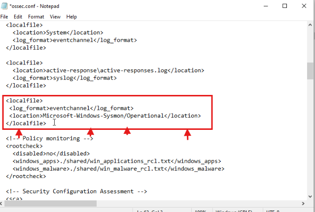


**What this does:**
- `<localfile>` — tells the agent to collect a log source
- `<log_format>eventchannel</log_format>` — specifies Windows Event Log format
- `<location>` — points to the Sysmon event channel specifically, so only Sysmon events are collected from this block

> ⚠️ Indentation matters — copy the spacing exactly as shown above or the agent may fail to restart.

---

### Adding File Integrity Monitoring Rules

Find the line `File Integrity Monitoring` in the config, then locate `<frequency>43200</frequency>` just below it. Paste the following **directly after** that line:

```xml
    <scan_on_start>yes</scan_on_start>
    <alert_new_files>yes</alert_new_files>
    <directories check_all="yes" realtime="yes" report_changes="yes" recursion_level="0">C:\Windows</directories>
    <directories check_all="yes" realtime="yes" report_changes="yes">C:\Users\*\Downloads</directories>
```
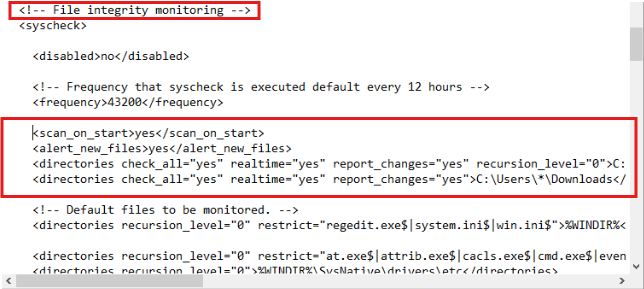


**What each line does:**

- `<scan_on_start>yes</scan_on_start>` — runs a full integrity scan every time the agent starts, establishing a fresh baseline
- `<alert_new_files>yes</alert_new_files>` — triggers an alert whenever a new file is created in a monitored directory
- `C:\Windows` with `recursion_level="0"` — monitors the root of the Windows directory for changes without recursing into every subfolder (keeps it efficient while catching top-level tampering)
- `C:\Users\*\Downloads` — monitors the Downloads folder of every user on the machine in real time, a common drop location for malicious files

**Save the config** and close the editor.


---

### Restart the Wazuh Agent

In the win32ui window:

- Click **Manage** → **Restart**
- Then click **Manage** → **Status**

The status should show the agent as **Running**.

---

## Step 8 — Verify Logs on the Wazuh Dashboard

Open the Wazuh dashboard in your browser and navigate to:

**Menu (three horizontal lines)** → **Explore** → **Discover**

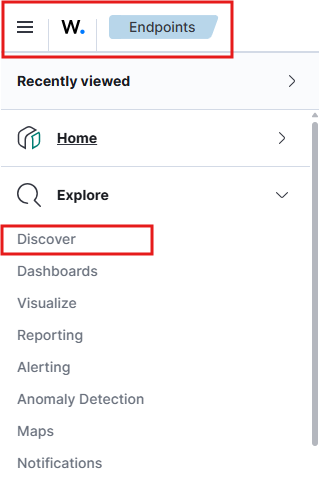

This is the live log feed for all your agents.

**Set up your filters** by selecting the following fields from the left panel:

- `agent.ip`
- `agent.name`
- `rule.description`

**Set your time range** — for testing, set it to the last 15 minutes with auto-refresh every 10 seconds.
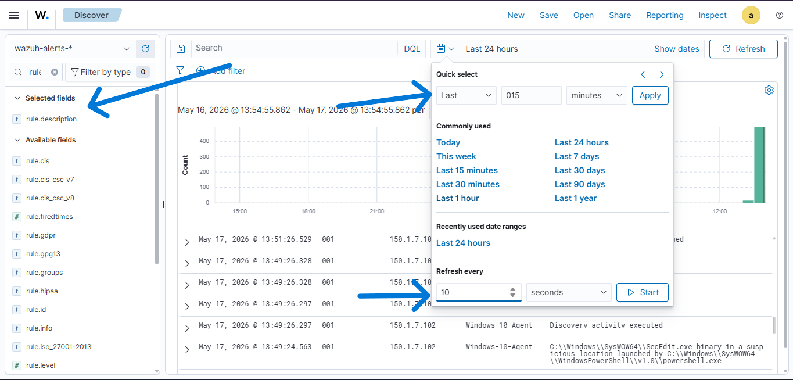

**Test it out:**


Create or modify a file inside the `Downloads` folder on your Windows 10 VM. Within a few seconds you should see an alert appear in the Wazuh dashboard showing the file activity — logged, timestamped, and attributed to your agent.
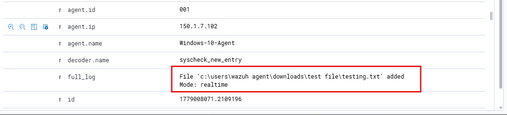

---

## ✅ What We Covered

By the end of this part you have:

- A solid understanding of what Wazuh agents are and why logs matter in a SOC environment
- A Windows 10 VM deployed and connected to the isolated internal network
- A Wazuh agent running on the Windows 10 VM and reporting to the server
- Sysmon installed with a community-maintained filter config for high-quality event logging
- File Integrity Monitoring configured to watch `C:\Windows` and user Downloads folders in real time
- Live log visibility in the Wazuh dashboard with agent filtering

---

## ➡️ Next Part

In **Part 3** we'll integrate **VirusTotal** with Wazuh — so whenever a suspicious file lands on a monitored machine, Wazuh automatically checks it against VirusTotal's database and generates an alert. Real threat intelligence, automated.

[← Back to Series Home](../README.md)
